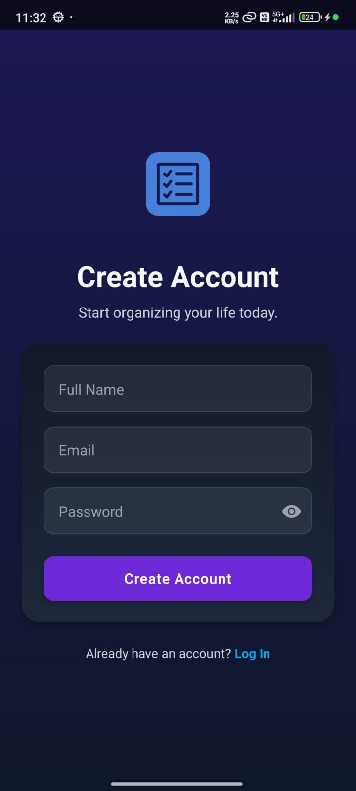
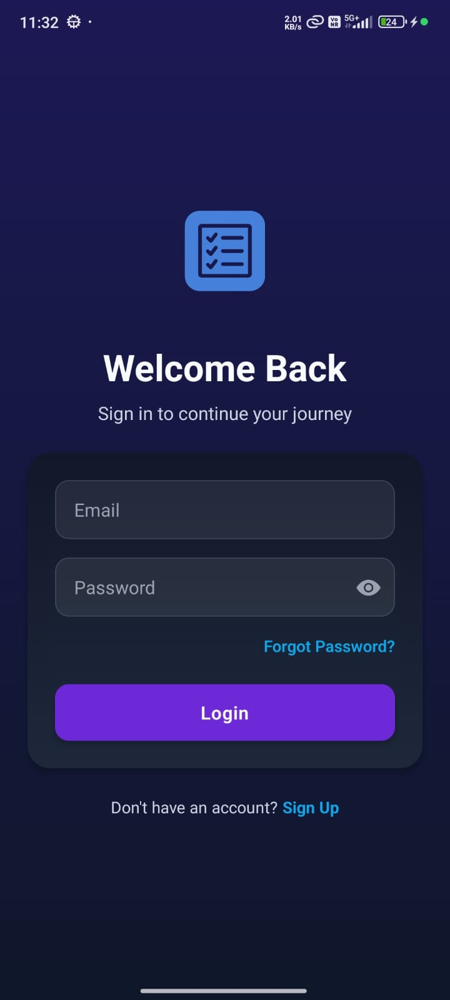
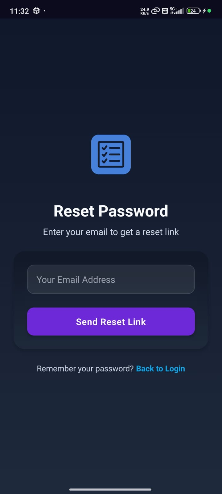
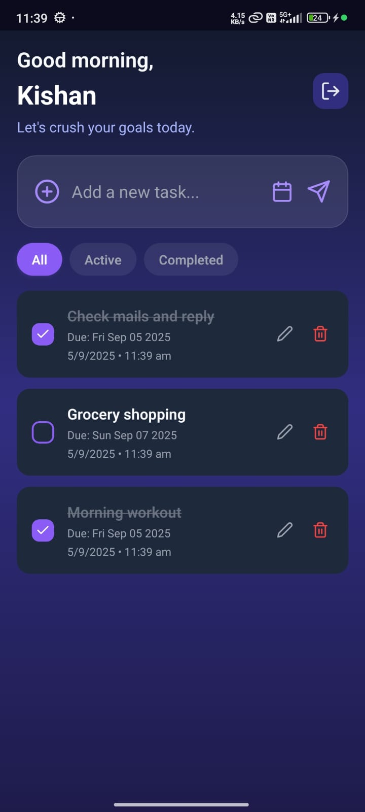
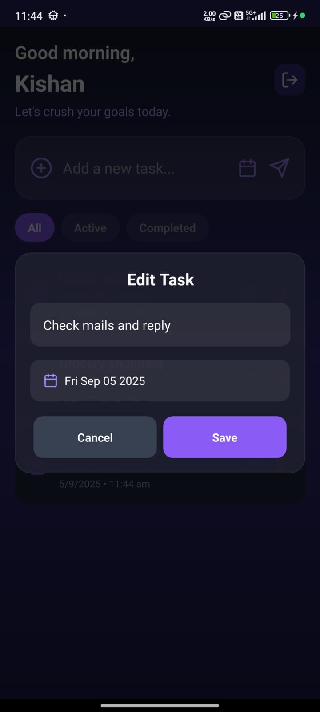

# Nexeed To-Do App

A simple and functional **To-Do List** mobile application built using **React Native**. The app allows users to manage their daily tasks with cloud synchronization, clean UI, and persistent data storage.

---


## Features

### Core Features

- **User Login & Signup:** Users can create an account or log in using Firebase Authentication.  
- **Forgot Password:** Users can reset their password via email if they forget it. The app sends a password reset link through Firebase      Authentication.
- **View Tasks:** Displays a list of all tasks on the main screen.
- **Add Task:** Users can add new tasks using an input field and submit button.
- **Complete Task:** Mark tasks as completed with a checkbox or toggle. Completed tasks show visual indication (strikethrough).
- **Delete Task:** Permanently remove tasks from the list.
- **Data Persistence:** Tasks are stored in **Firebase Firestore**, ensuring they persist even after closing the app.


### Bonus Features

- **Edit Task:** Users can edit existing tasks, including the text and due date.
- **Task Filtering:** Filter tasks by **All**, **Active**, or **Completed** using tabs.
- **Due Dates:** Option to set a due date for each task.
- **Cloud Sync:** Tasks automatically sync across devices using Firebase Firestore.
- **Smooth Animations & Feedback:** Task actions like add, delete, complete, and edit have smooth animations and immediate visual feedback for a professional user experience.
- **Optimistic Updates:** Task actions update immediately in the UI while syncing with the backend.

---

## Screenshots

 
 
 

---

## Demo

<p align="center">
  <a href="https://drive.google.com/file/d/11mQwHDSawP7zfUovAC6Swq5_X0Sc_tro/view?usp=drive_link" target="_blank">Watch the App in Action</a>
</p>

---

## Tech Stack

- **Framework:** React Native (Expo)
- **Database:** Firebase Firestore
- **Authentication:** Firebase Authentication
- **UI/UX:** React Native + LinearGradient + Skeleton Loaders
- **State Management:** React Hooks (`useState`, `useEffect`, `useMemo`)
- **Animations:** React Native Animated API for skeleton shimmer

---

## Setup & Installation

1. **Clone the repository**
   ```bash
   git clone https://github.com/Kishan89/NexeedTodoApp.git
   cd NexeedTodoApp

2. **Install dependencies**
   npm install
   # or
   yarn install

3. **Run the app**
   npx expo start

**Technical Choices:**
- React Native & Expo: Fast development, cross-platform compatibility, and easy testing.
  I chose this because it allows building both iOS and Android apps quickly with a single codebase.
- Firebase Firestore: Real-time sync, offline persistence, and scalability.
  Chosen for simplicity in cloud data storage and real-time updates for tasks.
- React Hooks: Clean and maintainable state management.
  Helps keep components functional and easy to understand.
- Skeleton Loaders & Optimistic Updates:Smooth and responsive UI even on slow networks.
  Improves UX by showing placeholders and immediate feedback on user actions.
- LinearGradient & Dark Theme: Modern, visually appealing, and consistent UI.
  Enhances the professional look of the app.

## Project Structure

```markdown

📁 NEXEEDTODOAPP/
├── assets/
├── components/
│   ├── AuthLayout.js
│   ├── Button.js
│   ├── EditTaskModal.js
│   ├── EmptyState.js
│   ├── FilterTabs.js
│   ├── HeaderBar.js
│   ├── Input.js
│   ├── TaskInput.js
│   └── TaskItem.js
├── config/
│   └── firebaseConfig.js
├── navigation/
│   └── AppNavigator.js
├── screens/
│   ├── ForgotPasswordScreen.js
│   ├── HomeScreen.js
│   ├── LoginScreen.js
│   └── SignupScreen.js
├── .gitignore
├── App.js
├── app.json
└── index.js
```

## Future Improvements
- Push Notifications for task reminders.
- Dark/Light mode toggle.
- Task categories or tags.
- Advanced filtering and sorting.
- Integration with calendar apps.
